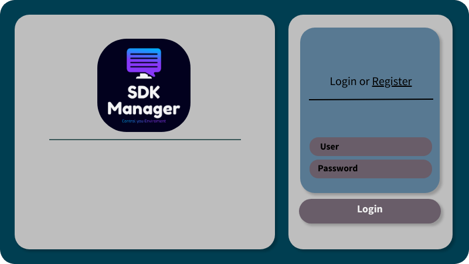
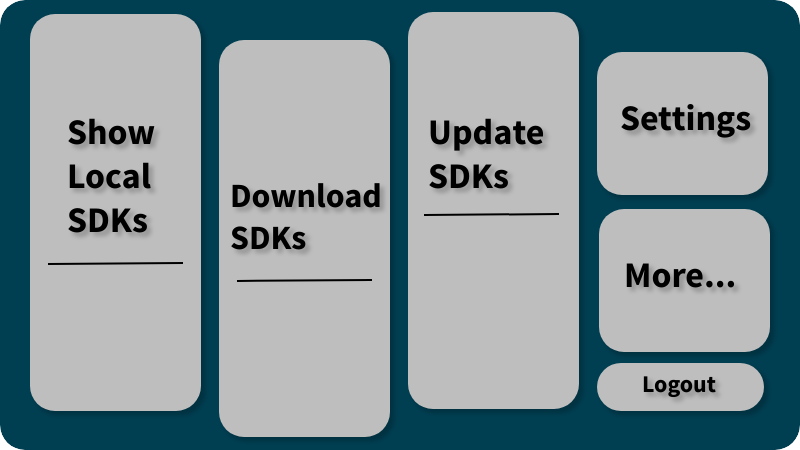
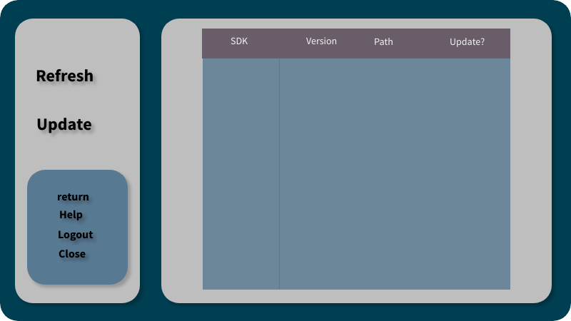

# Sketching 

## Index 
- [Sketching](#sketching)
  - [Index](#index)
  - [Startup Sketches](#startup-sketches)
    - [Login screen](#login-screen)
    - [MainMenu Screen](#mainmenu-screen)
    - [LocalSdksList Screen](#localsdkslist-screen)
    - [UpdateSdk Screen](#updatesdk-screen)
    - [Settings Screen](#settings-screen)
    - [Help Screen](#help-screen)

## Startup Sketches 

### Login screen

> In the login screen you can use your username and passower to log in or you can easly register your self into our database.
> This shall help us to customize and store your current local SDKs into our data base.

### MainMenu Screen

> In the MainMenu screen you can see the main functionalties of the software , clicking on more can scroll for further fucntionalties.
> clicking on setting leads to Settings Screen.
> clicking on logout logs the current user out of the software.

### LocalSdksList Screen

> In The LocalSdksList Screen you can go through all your local sdks.
> Clicking on Refresh shall refresh the list.
> Clicking on Update shall send to the UpdateSdkScreen.
> Clicking on retrun shall send you back to the MainMenu Screen
> Clicking on Help start HelpScreen
> Clicking on Logout shall take you back to the LoginScreen
> Clicking on close close the SDK Manager

### UpdateSdk Screen

TBD

### Settings Screen

TBD

### Help Screen 

TBD